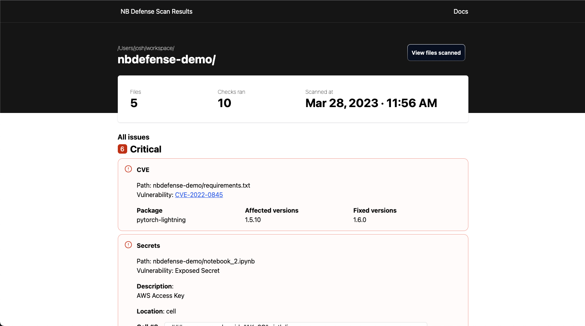
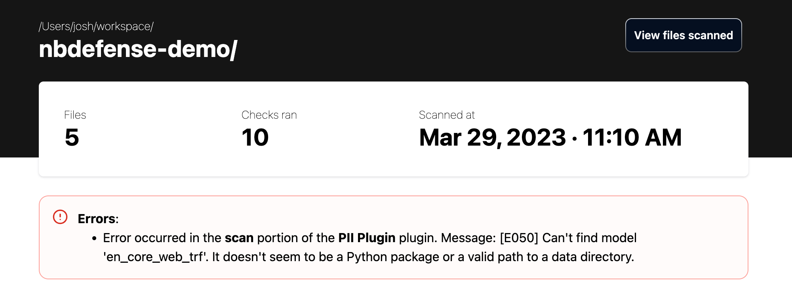

## Installation

1.  Activate the Python environment that you would like to install the NB Defense CLI to.

2.  Install the extension with pip:

    ```bash
    pip install nbdefense
    ```

3.  (Optional) Install the Spacy model for PII detection with:

    ```bash
    python -m spacy download en_core_web_trf
    ```

    !!! warning "Spacy model download"

        This is required for the PII plugin to operate. If you do not install the `en_core_web_trf` model, then you will get the following error message in the scan output with the PII plugin activated:
        ```
        Error occurred in the scan portion of the PII Plugin plugin.
        Message: [E050] Can't find model 'en_core_web_trf'.
        It doesn't seem to be a Python package or a valid path to a data directory.
        ```

4.  Check that the CLI is installed with:

    ```bash
    nbdefense --help
    ```

    And you should see an output like this:

    ```
    Usage: nbdefense [OPTIONS] COMMAND [ARGS]...

    Options:
      --version      Show the version and exit.
      -v, --verbose
      --help         Show this message and exit.

    Commands:
      scan      Scan [PATH] for .ipynb files for potential issues.
      settings  Commands related to NB Defense settings.
    ```

## Usage

The NB Defense CLI has two core commands:

### `nbdefense scan`

Help output:

```
Usage: nbdefense scan [OPTIONS] [PATH]

  Scan [PATH] for .ipynb files for potential issues.

Options:
  -r, --recursive                 Scan all nested directories for .ipynb
                                  files.
  -s, --serve                     Run an HTTP Server to view the report
                                  instead of persisting the report as an html
                                  file.
  -q, --quiet                     Suppress all output.
  -d, --dependency-file PATH      Specify a requirements.txt file to scan for
                                  CVEs and license compatibility.
  -f, --output-file FILE          Specify an output filename for the report.
  -o, --output-format [json|html]
                                  The output format for the report.
  -y, --yes                       Bypass all prompts with an affirmative
                                  response.
  --settings-file FILE            Specify a settings file to use for the scan.
                                  Defaults to [PATH]/settings.toml.
  --no-progress-bars              Hide progress bars, but keep other logging
                                  active.
  --help                          Show this message and exit.
```

The scan command is the main functionality of the NB Defense CLI. Running a scan will create a scan report that can be formatted as JSON or HTML.

### `nbdefense settings create`

Help output:

```
Usage: nbdefense settings create [OPTIONS]

  Create a settings file in the current working directory.

Options:
  -f, --force          Overwrite existing settings file if it exists.
  -l, --location FILE  The specific filepath to write the settings.toml file.
  --help               Show this message and exit.
```

This will create a `settings.toml` file which allows you to change certain scan settings. More information about NB Defense scan settings can be found on the [Scan Settings page](../scan-settings/index.md).

## Interpreting Scan Results

Scan results can be generated as either HTML or JSON. The HTML results will be more human readable and can be served using the `--serve` flag, where the JSON results are better for parsing with machine output. The JSON reports are used to generate the HTML report and the scan results screen of the JupyterLab Extension.

### The HTML Report

HTML is the default output format for the NB Defense CLI.



There are two sections of the HTML report that will always be present:

1.  The header
    - Contains information such as the number of files that were scanned, how many checks were run, and the timestamp of when the scan was run.
    - Also has a button to view which files were scanned for this run.
2.  The issues list
    - The report also includes a list of all of the issues found while scanning the notebook/directory. These issues are sorted by severity and will contain all relevant information for the detected issue.

An errors section of the report may be present if an exception happened during the scan.



### The JSON Report

Here is an example JSON report output:

??? abstract "output.json"

    ```json
    {
      "root": "nbdefense-demo",
      "root_issues": [
        {
          "code": "UNAPPROVED_LICENSE_DEP_FILE",
          "severity": "MEDIUM",
          "details": {
            "package_name": "matplotlibXtns",
            "package_version": "20.5",
            "unapproved_license": "GNU General Public License (GPL)",
            "file_path": "nbdefense-demo/requirements.txt"
          }
        },
        {
          "code": "VULNERABLE_DEPENDENCY_DEP_FILE",
          "severity": "CRITICAL",
          "details": {
            "file_path": "nbdefense-demo/requirements.txt",
            "results": {
              "VulnerabilityID": "CVE-2022-0845",
              "PkgName": "pytorch-lightning",
              "InstalledVersion": "1.5.10",
              "FixedVersion": "1.6.0",
              "Layer": {},
              "SeveritySource": "nvd",
              "PrimaryURL": "https://avd.aquasec.com/nvd/cve-2022-0845",
              "DataSource": {
                "ID": "osv",
                "Name": "Python Packaging Advisory Database",
                "URL": "https://github.com/pypa/advisory-db"
              },
              "Title": "Code Injection in PyTorch Lightning",
              "Description": "Code Injection in GitHub repository pytorchlightning/pytorch-lightning prior to 1.6.0.",
              "Severity": "CRITICAL",
              "CweIDs": ["CWE-94"],
              "CVSS": {
                "ghsa": {
                  "V3Vector": "CVSS:3.1/AV:N/AC:L/PR:N/UI:N/S:U/C:H/I:H/A:H",
                  "V3Score": 9.8
                },
                "nvd": {
                  "V2Vector": "AV:N/AC:L/Au:N/C:C/I:C/A:C",
                  "V3Vector": "CVSS:3.1/AV:N/AC:L/PR:N/UI:N/S:U/C:H/I:H/A:H",
                  "V2Score": 10,
                  "V3Score": 9.8
                }
              },
              "References": [
                "https://github.com/PyTorchLightning/pytorch-lightning/pull/12212",
                "https://github.com/advisories/GHSA-r5qj-cvf9-p85h",
                "https://github.com/pypa/advisory-database/tree/main/vulns/pytorch-lightning/PYSEC-2022-181.yaml",
                "https://github.com/pytorchlightning/pytorch-lightning/commit/8b7a12c52e52a06408e9231647839ddb4665e8ae",
                "https://huntr.dev/bounties/a795bf93-c91e-4c79-aae8-f7d8bda92e2a",
                "https://nvd.nist.gov/vuln/detail/CVE-2022-0845"
              ],
              "PublishedDate": "2022-03-05T22:15:00Z",
              "LastModifiedDate": "2022-03-10T22:00:00Z"
            }
          }
        }
      ],
      "plugins": [
        {
          "name": "PII Plugin",
          "settings": {
            "enabled": true,
            "confidence_threshold": 0.8,
            "entities": {
              "US_PASSPORT": true,
              "AU_MEDICARE": true,
              "AU_TFN": true,
              "AU_ACN": true,
              "AU_ABN": true,
              "UK_NHS": true,
              "US_SSN": true,
              "US_ITIN": true,
              "US_DRIVER_LICENSE": true,
              "US_BANK_NUMBER": true,
              "MEDICAL_LICENSE": true,
              "LOCATION": true,
              "PHONE_NUMBER": true,
              "NRP": true,
              "IP_ADDRESS": true,
              "EMAIL_ADDRESS": true,
              "IBAN_CODE": true,
              "CRYPTO": true,
              "CREDIT_CARD": true,
              "PERSON": true
            }
          }
        },
        {
          "name": "Secrets Plugin",
          "settings": {
            "enabled": true,
            "secrets_plugins": [
              { "name": "SoftlayerDetector" },
              { "name": "StripeDetector" },
              { "name": "SendGridDetector" },
              { "name": "NpmDetector" },
              { "name": "KeywordDetector", "keyword_exclude": "" },
              { "name": "IbmCosHmacDetector" },
              { "name": "DiscordBotTokenDetector" },
              { "name": "BasicAuthDetector" },
              { "name": "AzureStorageKeyDetector" },
              { "name": "ArtifactoryDetector" },
              { "name": "AWSKeyDetector" },
              { "name": "CloudantDetector" },
              { "name": "GitHubTokenDetector" },
              { "name": "IbmCloudIamDetector" },
              { "name": "JwtTokenDetector" },
              { "name": "MailchimpDetector" },
              { "name": "PrivateKeyDetector" },
              { "name": "SlackDetector" },
              { "name": "SquareOAuthDetector" },
              { "name": "TwilioKeyDetector" },
              { "name": "Base64HighEntropyString", "limit": 4.5 },
              { "name": "HexHighEntropyString", "limit": 3.0 }
            ]
          }
        },
        {
          "name": "License Plugin for Dependency Files",
          "settings": {
            "enabled": true,
            "accepted_licenses": [
              "Apache License 2.0",
              "Apache Software License",
              "Apache 2.0",
              "Apache-2.0",
              "BSD",
              "BSD License",
              "BSD 3-Clause",
              "BSD-3-Clause",
              "GNU Library or Lesser General Public License (LGPL)",
              "Microsoft Public License",
              "MIT",
              "MIT License",
              "Python Software Foundation License",
              "ISC License (ISCL)",
              "MIT-0"
            ]
          }
        },
        {
          "name": "CVE Plugin for Dependency Files",
          "settings": { "enabled": true }
        }
      ],
      "notebooks": [
        "nbdefense-demo/Untitled1.ipynb",
        "nbdefense-demo/notebook_1.ipynb",
        "nbdefense-demo/Untitled.ipynb",
        "nbdefense-demo/notebook_2.ipynb"
      ],
      "notebook_issues": [
        { "path": "nbdefense-demo/Untitled1.ipynb", "issues": [] },
        {
          "path": "nbdefense-demo/notebook_1.ipynb",
          "issues": [
            {
              "code": "PII_FOUND",
              "severity": "HIGH",
              "cell": {
                "cell_index": 0,
                "cell_type": "SOURCE",
                "scrubbed_content": "#!pip install [PII]"
              },
              "location": "INPUT",
              "details": {
                "description": "A total of 1 PII found in cell number 0",
                "summary_field": { "PERSON": 1 }
              },
              "issues": [
                {
                  "code": "PII_FOUND",
                  "severity": "HIGH",
                  "cell": {
                    "cell_index": 0,
                    "cell_type": "SOURCE",
                    "scrubbed_content": "#!pip install [PII]"
                  },
                  "line_index": 0,
                  "location": "INPUT",
                  "character_start_index": 14,
                  "character_end_index": 19,
                  "details": null
                }
              ]
            }
          ]
        },
        { "path": "nbdefense-demo/Untitled.ipynb", "issues": [] },
        {
          "path": "nbdefense-demo/notebook_2.ipynb",
          "issues": [
            {
              "code": "PII_FOUND",
              "severity": "HIGH",
              "cell": {
                "cell_index": 11,
                "cell_type": "SOURCE",
                "scrubbed_content": "print(name)\nprint('another line')\nprint('[PII] changed cell')\n'[PII]'"
              },
              "location": "INPUT",
              "details": {
                "description": "A total of 2 PII found in cell number 11",
                "summary_field": { "PERSON": 2 }
              },
              "issues": [
                {
                  "code": "PII_FOUND",
                  "severity": "HIGH",
                  "cell": {
                    "cell_index": 11,
                    "cell_type": "SOURCE",
                    "scrubbed_content": "print(name)\nprint('another line')\nprint('[PII] changed cell')\n'[PII]'"
                  },
                  "line_index": 2,
                  "location": "INPUT",
                  "character_start_index": 7,
                  "character_end_index": 21,
                  "details": null
                },
                {
                  "code": "PII_FOUND",
                  "severity": "HIGH",
                  "cell": {
                    "cell_index": 11,
                    "cell_type": "SOURCE",
                    "scrubbed_content": "print(name)\nprint('another line')\nprint('[PII] changed cell')\n'[PII]'"
                  },
                  "line_index": 3,
                  "location": "INPUT",
                  "character_start_index": 1,
                  "character_end_index": 14,
                  "details": null
                }
              ]
            },
            {
              "code": "SECRETS",
              "severity": "CRITICAL",
              "cell": {
                "cell_index": 8,
                "cell_type": "MARKDOWN",
                "scrubbed_content": "### aws_access_key_id=\"AK..6C\"\n\n\n\n\nsixth line"
              },
              "line_index": 0,
              "location": "INPUT",
              "character_start_index": 23,
              "character_end_index": 43,
              "details": { "description": "AWS Access Key", "summary_field": null }
            }
          ]
        }
      ],
      "errors": [
        {
          "error_type": "SCAN",
          "plugin_name": "PII Plugin",
          "message": "error message"
        }
      ]
    }
    ```

#### The `root` element

This is the `PATH` that was passed to the `nbdefense scan PATH` command.

```json
{
  "root": "nbdefense-demo",
  ...
}
```

#### The `root_issues` element

Contains all of the issues related to the dependency file. This includes any CVEs or license issues.

```json
{
  ...,
  "root_issues": [
    {
      ISSUE_CONTENTS
    }
  ],
  ...
}
```

#### The `plugins` element

An array containing the plugins that were run in the scan. Also includes the settings for the plugins.

```json
{
  ...,
  "plugins": [
    {
      PLUGIN_SETTINGS
    }
  ],
  ...
}
```

#### The `notebooks` element

The list of notebooks included in this scan.

```json
{
  ...,
  "notebooks": ["nbdefense-demo/notebook_1.ipynb"],
  ...
}
```

#### The `notebook_issues` element

A list of objects containing paths and issues for each notebook.

```json
{
  ...,
  "notebook_issues": [
    {
      "path": "nbdefense-demo/notebook_1.ipynb",
      "issues": [
        {
          ISSUE_CONTENTS
        }
      ]
    }
  ],
  ...
}
```

#### The `errors` element

A list of the errors that occurred during the scan. This element will only be included if at least one error occurs during the scan.

```json
{
  ...,
  "errors": [
    {
      ERROR_CONTENTS
    }
  ],
  ...
}
```

## Adjusting Scan Settings

You can change and update settings for your scan from a `settings.toml` file. More info is available on the [Scan Settings](../scan-settings/index.md) page.
