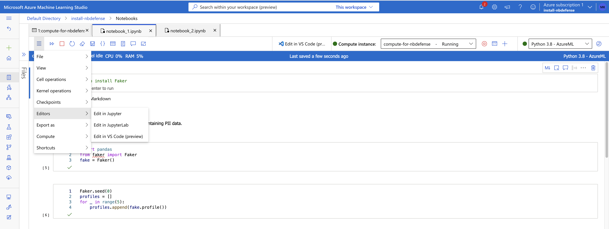
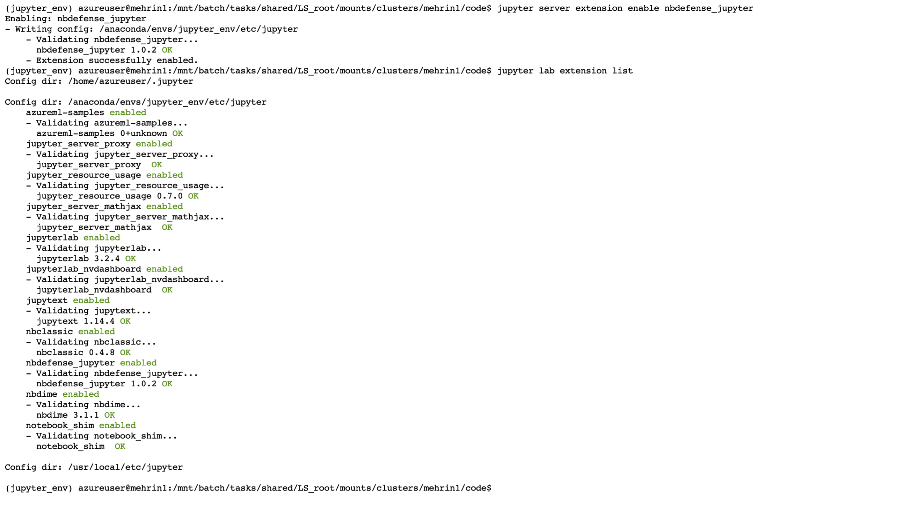
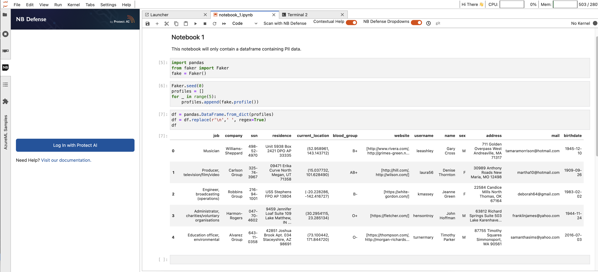
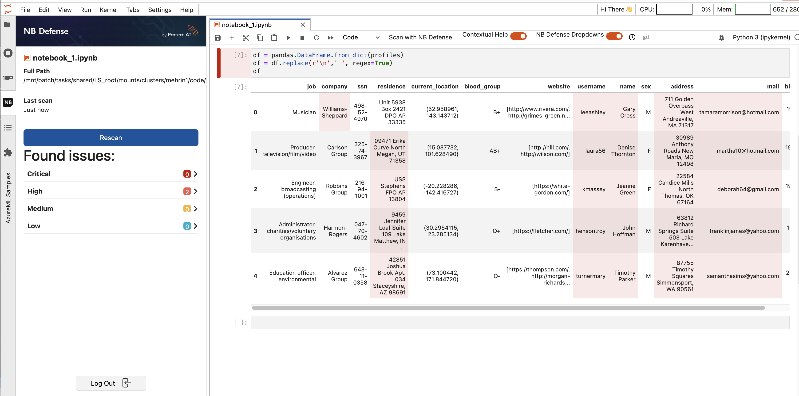

# Configuring NB Defense for Azure ML Notebooks

This section outlines the steps for installation of NB Defense in [Azure Machine Learning Studio](https://azure.microsoft.com/en-us/products/machine-learning/).

1.  Open the notebook you want to scan in JupyterLab by accessing the Editor menu as shown below:

    |                                                  |
    | :-------------------------------------------------------------------------: |
    | _Open jupyter notebook in Jupyter Lab using Azure Machine Learning Studio._ |

2.  From JupyterLab, open a new terminal.

3. Activate `jupyter_env` environment using the following command:

    ```
    conda activate jupyter_env
    ``` 

4. The JLE can now be installed using the following command:

    ```
    pip install nbdefense_jupyter
    ```

3.  Once NB Defense is installed, enable the extension using the following command:

    ```
    jupyter server extension enable nbdefense_jupyter
    ```

4.  Optionally you can also run:

    ```
    jupyter lab extension list
    ```

    to ensure the extension is enlisted. The above two commands should give an output similar to the one below: both commands list **nbdefense_jupyter**.

    |                                                             |
    | :------------------------------------------------------------------------------------: |
    | _Enabling the NBDefense Jupyter Lab Extension (JLE) in Azure Machine Learning Studio._ |

5.  Restart the jupyter server using:

    ```
    sudo systemctl restart jupyter
    ```

    and refresh the browser. This should show the NB Defense widget installed in the left menu:

    
6.  Refresh the JupyterLab webpage (CMD+R on a Mac or CTRL+R on a Windows machine). You should now be able to see the NBDefense JLE widget on the left hand side of the JupyterLab UI.

    |                                                                            |
    | :---------------------------------------------------------------------------------------------------: |
    | _Successful installation of NB Defense Jupyter Lab Extension (JLE) in Azure Machine Learning Studio._ |


That is it! You can now log in, and press the scan button and see if there are any issues in your notebook as outlined by the NB Defense scan. For example, in the notebook below NB Defense scan has found some personally identifiable information (PII) (note the PII is fake).

|                                                                 |
| :----------------------------------------------------------------------------------------: |
| _NB Defense Jupyter Lab Extension (JLE) scan results using Azure Machine Learning Studio._ |
