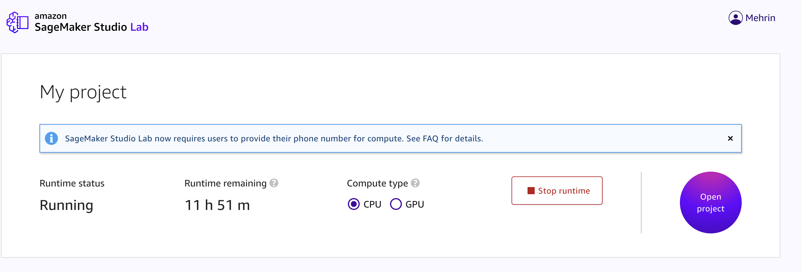

# Configuring NB Defense for SageMaker Studio Lab

This section covers the installation of NB Defense on [SageMaker Studio Lab](https://studiolab.sagemaker.aws/)

1.  Open a terminal session within SageMaker Studio Lab

2.  Activate the studiolab environment by running:

    ```shell
    conda activate studiolab
    ```

3.  Install the extension with pip (please ensure to replace your license key with {LICENSE_KEY} or get your pre-filled link from the [NB Defense web portal](https://nbdefense.protectai.com/)):

    ```shell
    pip install nbdefense_jupyter 
    ```

4.  Enable the server extension with

    ```shell
    jupyter server extension enable nbdefense_jupyter
    ```

5.  Go to the Studio Lab project overview page.

    

6.  Select Stop runtime.
7.  Select Start runtime.
8.  Reopen the JupyterLab session with the "Open project" button and the NB Defense extension should be there.

## Need more help?

More details about how to manage your SageMaker Studio Lab environment can be found in [the official documentation](https://docs.aws.amazon.com/sagemaker/latest/dg/studio-lab-use-manage.html#studio-lab-use-manage-conda-jupyter)
