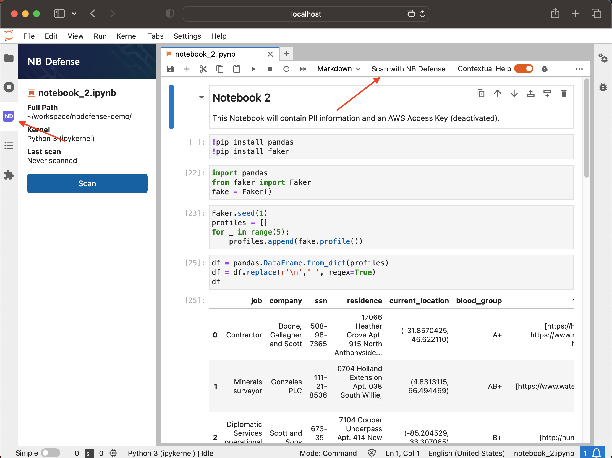
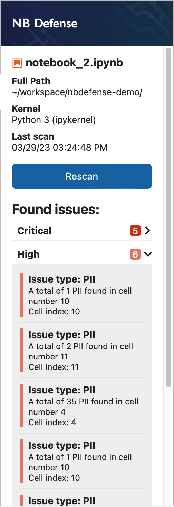

## Installation

!!! info "Running NB Defense on JupyterLab in the cloud"

    The following instructions are for a local installation of JupyterLab. If you are interested in running the JupyterLab Extension on a cloud platform, please visit the [JupyterLab Extension on Cloud Services](./cloud-services/index.md) page for instructions for each platform.

1.  Activate the Python environment that you use to run JupyterLab.

    !!! warning "Supported JupyterLab Versions"

        The NB Defense JupyterLab extension works with versions of JupyterLab >=3 and <4.

2.  Install the extension with pip:

    ```bash
    pip install nbdefense_jupyter
    ```

3.  (Optional) Install the Spacy model for PII detection with:

    ```bash
    python -m spacy download en_core_web_trf
    ```

    !!! warning "Spacy model download"

        This is required for the PII plugin to operate. If you do not install the `en_core_web_trf` model, then you will get the following error message in the scan output with the PII plugin activated:
        ```
        Error occurred in the scan portion of the PII Plugin plugin.
        Message: [E050] Can't find model 'en_core_web_trf'.
        It doesn't seem to be a Python package or a valid path to a data directory.
        ```

4.  Activate the server extension with:

    ```bash
    jupyter server extension enable nbdefense_jupyter
    ```

5.  Start (or restart) the JupyterLab session and the NB Defense extension should be ready to go! You will know the extension has been installed successfully if you are able to see the new NB Defense tab and the `Scan with NB Defense` button in the toolbar.
    ```bash
    jupyter lab
    ```
    

## Usage

Once the extension has been installed, you can now start scanning your notebooks within the JupyterLab environment.

Installing the NB Defense JupyterLab Extension (JLE) will add a tab with an NB icon to your side bar. Clicking this will take you to the NB Defense JLE panel. From there you can run a scan or view scan results for the currently focused notebook.

<video autoplay loop muted src="../../imgs/open-nb-defense-panel.mp4">
    Open NB Defense panel video
</video>

You can also run a scan by clicking the `Scan with NB Defense` button in the notebook toolbar.

<video autoplay loop muted src="../../imgs/run-scan-from-toolbar.mp4">
    Run a scan from the toolbar video
</video>

## Interpreting Scan Results

Within the side panel we display a list of issues detected during the scan. The information on the side bar includes the "Issue type", a short description of the issue, and which cell index the issue was found in.

{: style="height:600px"}

Clicking on one of the issues here will focus the relevant cell. From here you can see that the characters that triggered the scan will be underlined in the editor. Additionally, all of the cells that contain issues will have a red background.

<video autoplay loop muted src="../../imgs/focus-cell-from-issue.mp4">
    Focus cell from issue video
</video>

## Adjusting Scan Settings

You can change and update settings for your scan from the JupyterLab settings menu. More info is available on the [Scan Settings](../scan-settings/index.md) page.
