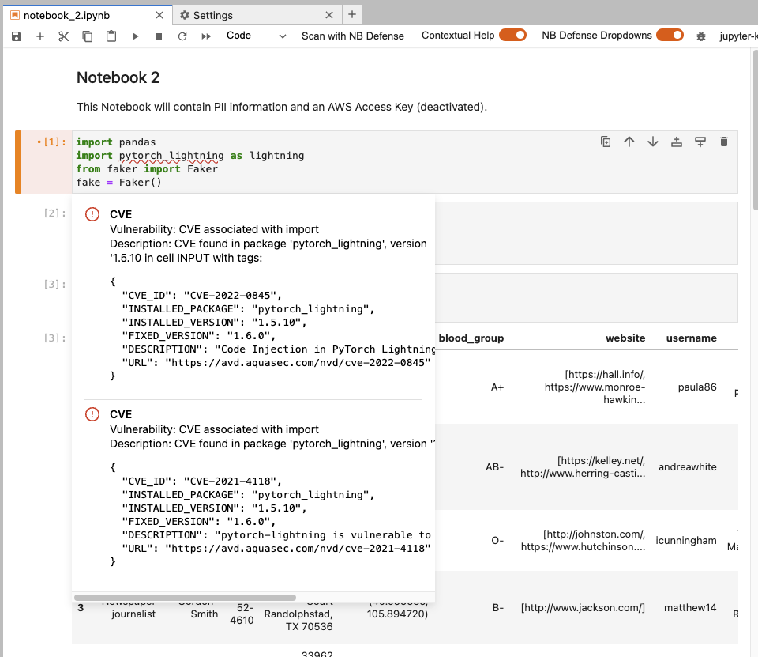
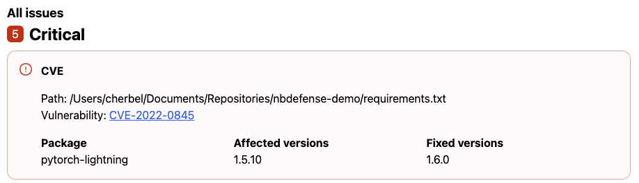

# CVE Detection

NB Defense scans for common vulnerabilities and exposures (CVEs) associated with the dependencies in your project's `requirements.txt` file and your python environment. We evaluate your dependencies with Aqua's [Trivy](https://github.com/aquasecurity/trivy) tool to detect any known vulnerabilities.

## CVE Detection with the Jupyter Lab Extension (JLE)

The NB Defense Jupyter Lab Extension tracks your notebooks currently configured kernel to scan imported third party dependencies for CVEs.

!!! warning

    Before you begin, please configure a kernel for the notebook you plan to scan, and install all the third party dependencies neccessary to execute your notebook into the kernel. If the notebooks dependencies are not installed in the kernel and are not imported by the notebook, they will not be scanned. You can check that all dependencies are correctly installed by running the python code in your notebook; if your python code is valid and executes without any errors, all related dependencies should be installed correctly.

Before scanning, verify that the kernel in the NB Defense panel matches the kernel that you have configured. When you press scan, NB Defense will gather imported modules from your notebook and link them to third party packages installed in your kernel. The installed version of the package associated with the imported modules will then be scanned for known CVEs.

### JLE Settings

You can enable or disable cve scanning in the [Jupyter Lab Extensions settings](/scan-settings/jupyterlab-settings).

### JLE Scan Results

Once a scan completes, any imported modules with associated CVEs will be added to the report and you will be provided with information about each CVE. The report below includes the CVE ID, the package and version with the issue, along with the fixed version, description, and a url to learn more.

|                                   |
| :------------------------------------------------------------------: |
| _NBDefense Jupyter Lab Extension (JLE) scan report with CVEs found._ |

## CVE Detection with the CLI

The NBDefense CLI currently supports scanning for CVEs with a python `requirements.txt` file. A dependency will only be scanned for CVEs if the version is pinned to a specific version number (ei. `numpy==1.0.0` and not `numpy>=1.0.0`).

### CLI Settings

Using your [settings.toml file](/scan-settings/cli-settings) you can enable or disable the CVE plugin.

!!! note "Example Settings"

    ```toml
    [plugins."nbdefense.plugins.CVEDependencyFilePlugin"]
    enabled = true
    ```

### CLI Scan Results

The results will provide you with information on what packages have issues, along with information on how to fix the issue.

|           |
| :------------------------------------------: |
| _NBDefense CLI scan report with CVEs found._ |
