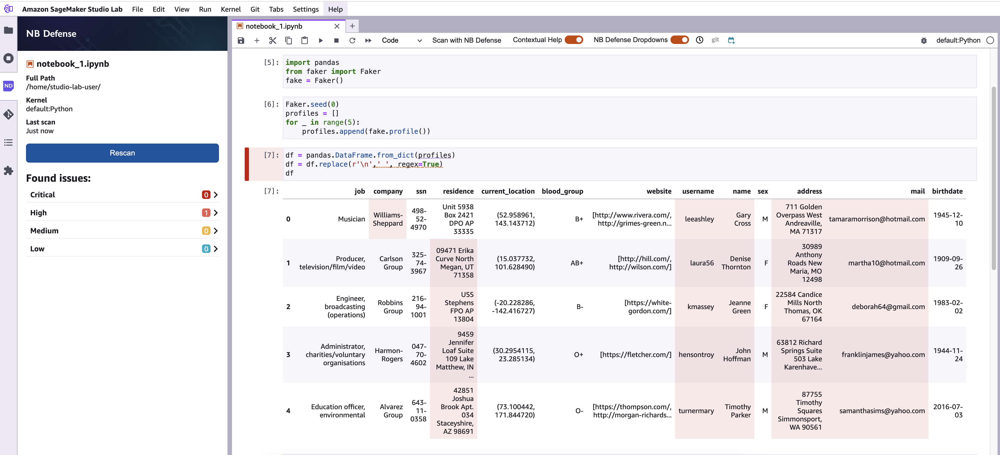

# Personally Identifiable Information (PII)
The NB Defense scans for any information that can be used to identify a person i.e., personally identifiable information (PII). It can be their name, location, bank information etc. 

NB Defense supports both global entities (such as names, email addresses) as well as country-specific entities (such as UK National Health Service (NHS) number). At the moment, the NB Defense PII plugin has support for English language only. 

The PII analyser is adapted from [Miscrosoft Presidio](https://microsoft.github.io/presidio/) whereas the PII anonymization is handled by NB Defense.

!!! warning

    Before you begin scanning with the PII plugin, please execute all code inside the notebook you would like scanned. This plugin does not execute code, and will only scan output for PII if it exists in the notebook.


## PII Entities
NB Defense supports the following PII entities:

### Global PII entities: 

| Global PII Entity  | Description  |
| :--     | :---         |
| PERSON |   If there is a name in a notebook, NB Defense will flag it as "PERSON". |
| CREDIT_CARD | If there is a number between 12 to 19 digits in a notebook, NB Defense will flag it as "CREDIT_CARD".|
| CRYPTO | If there is a Bitcoin wallet number in a notebook, NB Defense will flag it as "CRYPTO". At the moment, only Bitcoin addresses are supported. | 
| EMAIL_ADDRESS | If there is an email address in a notebook, NB Defense will flag it as "EMAIL_ADDRESS". |
| IBAN_CODE | If there is an International Bank Account Number (IBAN) in a notebook, NB Defense will flag it as "IBAN_CODE". |
| IP_ADDRESS | If there is an Internet Protocol (IP) version 4 or version 6 address in a notebook, NB Defense will flag it as "IP_ADDRESS". |
|NRP | If there is a mention of a person's nationality, religious or political affiliation (NRP) in a notebook, NB Defense will flag it as "NRP". |
|PHONE_NUMBER| If there is a telephone number in a notebook, NB Defense will flag it as a "PHONE_NUMBER".|
|LOCATION| If there is a geographraphically defined location name in a notebook such as a city, province or state name, NB Defense will flag it as "LOCATION". |
| MEDICAL_LICENSE | If there is a medical license number in a notebook, NB Defense will flag it as a "MEDICAL_LICENSE". |


### United States of America (US)-specific PII entities:


| US-Specific PII Entities | Description |
| :-- | :-- |
| US_BANK_NUMBER | If there is a US bank account number between 8 to 17 digits in a notebook, NB Defense will flag it as "US_BANK_NUMBER". |
| US_DRIVER_LICENSE | If there is a US driver license number in a notebook, NB Defense will flag it as "US_DRIVER_LICENSE". |
| US_ITIN | If there is a US Individual Taxpayer Identification Number (ITIN) in a notebook, NB Defense will flag it as "US_ITIN". The US ITIN starts with a "9" and has a "7" or "8" as the fourth digit. |
|US_PASSPORT | If there is a US passport number in a notebook, NB Defense will flag it as "US_PASSPORT". |
|US_SSN| If there is a US Social Security Number (SSN) in a notebook, NB Defense will flag it as "US_SSN". The US SSN has 9 digits.  |


### United Kingdom (UK)-specific PII entities:

|UK-specific PII Entities | Description |
|:--- | :--- |
| UK_NHS | If there is a UK National Health Service (NHS) number in a notebook, NB Defense will flag it as a "UK_NHS". The UK NHS is a 10 digit number. |


### Australia (AU)-specific PII entities:
|AU-specific PII Entities | Description |
|:--- | :--- |
| AU_ABN  | If there is an Australian Bank Number (ABN) in a notebook, NB Defense will flag it as a "AU_ABN". The ABN is a 11 digit number.  |
|AU_ACN | If there is an Australian Company Number (ACN) in a notebook, NB Defense will flag it as a "AU_ACN". The AU_ACN is a 9 digit number.  |
| AU_TFN | If there is an Australian Tax File Number (TFN) in a notbook, NB Defense will flag it as a "AU_TFN". |
| AU_MEDICARE| If there is an Australian Medicare number in a notbook, NB Defense will flag it as a "AU_MEDICARE". |


### PII Scan Results
Below is a sample result for JLE with PII found in ```notebook_2.ipynb``` 

|  |
| :--: |
| *NB Defense Jupyter Lab Extension (JLE) scan report with Personally Identifiable Information (PII) found.* |

For any PII found in the notebook, the scan flags it as a HIGH severity issue, and also includes the cell number where it is found. 

On clicking on the  ```Issue type: PII```  will focus the cell where PII is found. Upon hovering over the cell, NB Defense will show the total number of PII found in that cell: (in the sample scan result above) a total of 40 potential PII are found. 