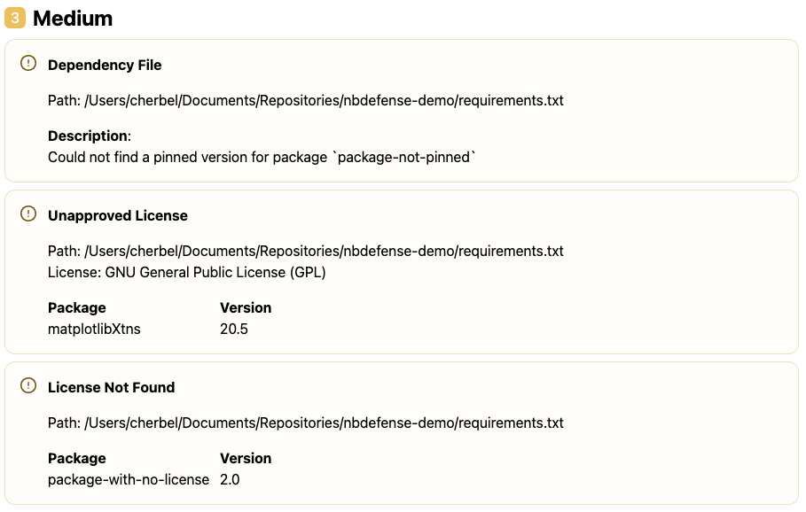

# License Detection

NB Defense scans for common vulnerabilities and exposures (CVEs) associated with the dependencies in your project's `requirements.txt` file and your python environment. We evaluate your dependencies for licenses that are not included in your list of accepted licenses.

## License Detection with the Jupyter Lab Extension (JLE)

The NB Defense Jupyter Lab Extension tracks your notebooks currently configured kernel to scan imported third party dependencies for licenses.

!!! warning

    Before you begin, please configure a kernel for the notebook you plan to scan, and install all the third party dependencies neccessary to execute your notebook into the kernel. If the notebooks dependencies are not installed in the kernel and are not imported by the notebook, they will not be scanned. You can check that all dependencies are correctly installed by running the python code in your notebook; if your python code is valid and executes without any errors, all related dependencies should be installed correctly.

Before scanning, verify that the kernel in the NB Defense panel matches the kernel that you have configured. When you press scan, NB Defense will gather imported modules from your notebook and link them to third party packages installed in your kernel. The installed version of the package associated with the imported modules will then be scanned for unapproved licenses.

### JLE Settings

You can configure your list of accepted licenses, and license source in the [Jupyter Lab Extensions settings](/scan-settings/jupyterlab-settings). Configure accepted licenses to include all licenses that are acceptable to your project's standards. Configure the license source to determine where NB Defense will look for license data associated with your package (local kernel, pypi, or a combination of the two).

### JLE Scan Results

The example below shows that an unapproved license has been found in the `matplotlibXtns` version `20.5` package.

|                                   |
| :----------------------------------------------------------------------: |
| _NBDefense Jupyter Lab Extension (JLE) scan report with licenses found._ |

## License Detection with the CLI

The NBDefense CLI currently supports scanning for licenses using a python `requirements.txt` file. A dependency will only be scanned for licenses if the version is pinned to a specific version number (ei. `numpy==1.0.0` and not `numpy>=1.0.0`).

### CLI Settings

Using your [settings.toml file](/scan-settings/cli-settings) you can configure the list of licenses to include licenses that are acceptable to your projects standards.

!!! note "Example Settings"

    ```toml
    [plugins."nbdefense.plugins.LicenseDependencyFilePlugin"]
    enabled = true
    accepted_licenses = ["Apache License 2.0", "BSD", "MIT", "Python Software Foundation License", "GNU Library or Lesser General Public License (LGPL)", "Apache Software License", "Apache 2.0", "Apache-2.0" , "BSD License", "BSD 3-Clause", "BSD-3-Clause", "Microsoft Public License" , "MIT License", "ISC License (ISCL)", "MIT-0"]
    ```

### CLI Scan Results

The example below surfaces three seperate issues: an unapproved license, a package where a license couldn't be found, and a package that does not have a pinned dependency.

|           |
| :----------------------------------------------: |
| _NBDefense CLI scan report with licenses found._ |
